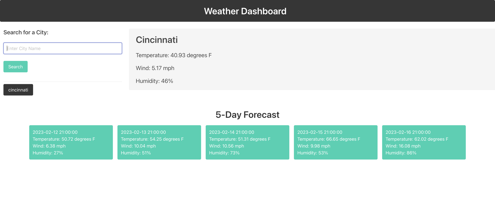

# Weather Application

## An application which provides the user a Five-Day weather forecast for a city that they input. Preovious searches are saved for a better user experience and future searches. 

## Installation
+ No installation required for this application

## Usage

+ GitHub Repository: https://github.com/priyanka-agrawal025/weather-application
+ Deployed Webpage: https://priyanka-agrawal025.github.io/weather-application/

## Credits
+ There were no collaborators on this project

## Licenses
+ An MIT License was used for this project

## Badges
